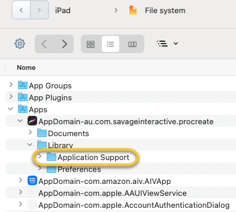

# Procreate Recovery & Timestamp Rebuilder 

*A Python tool to extract, fix, rename, and rebuild Procreate documents from an iPad backup.*


## Why this tool exists
As many of you know, iOS does not provide direct filesystem access to the internal Procreate document structure. When a canvas is stored on an iPad, the actual contents live inside the app’s protected sandbox.
This means:
- You cannot browse the internal Procreate `Application Support` folder the way you can on macOS.
- You cannot extract the internal files through the Files app.

The only reliable way to access the document structure is through an iTunes/Finder backup or through third-party backup tools such as iMazing.
When extracting files in this manner, you end up with several folders using UID-based names, each representing a Procreate document or a brush. To turn these folders back into functioning `.procreate` files, a dedicated tool is required.</br>
This project provides a Python script that converts these meaningless folders into valid `.procreate` files, while preserving their original creation and modification dates.


## Important: Where to obtain the data

You must extract the folder:

```
AppDomain-au.com.savageinteractive.procreate
    → Library
        → Application Support   ← THIS folder
```
from your iPad backup using **iMazing** or any other iOS backup extractor and copy the folder on your Mac in an empty directory




## How it works

Each Procreate document is stored as a folder containing:

- `Document.archive` — a binary plist holding the project name  
- Multiple layer subfolders with UID-based names, as well as two special folders: `QuickLook` and `video`.

The script:

1. Recursively scans all directories inside `Application Support`  
2. Identifies valid Procreate projects by checking for `Document.archive`  
3. Extracts the folder’s creation and modification date  
4. Reads project names using plistlib  
5. Generates a timestamp string (e.g., `25.11.21-14.32`)  
6. Prepends the project name with this timestamp  
7. Rewrites the archive with the updated name  
8. Zips the entire folder into a valid `.procreate` file  
9. Applies the original timestamp using macOS `SetFile`  
10. Saves the reconstructed and date tagged project

## Requirements

- macOS 10.15 or newer  
- Python 3.9+  
- Xcode Command Line Tools (for SetFile)

In a new Terminal window install the tools if needed:

```bash
xcode-select --install
```

## Usage

```bash
python3 export_procreate.py /path/to/Application\ Support/
```


## Notes

Procreate uses a proprietary, undocumented storage format with Apple-specific LZ4 compression.  
This script does **not** attempt to decode internal tile data.  
It only reconstructs the outer `.procreate` bundle so that Procreate can load it again.

## Acknowledgements
Special thanks to Jarom Vogel for his outstanding work on Prospect, an indispensable tool for previewing and managing `.procreate` files on macOS.
[Download](https://jaromvogel.com/prospect/Prospect_v1_2_1.zip)

The following GitHub repositories were fundamental during development:
- [Procreate Viewer](https://github.com/jaromvogel/ProcreateViewer)
- [Prospect](https://github.com/jaromvogel/prospect)

## License
Licensed under the MIT License. See **LICENSE.md** for full license text. 

If you find this helpful, please star the project on GitHub!
