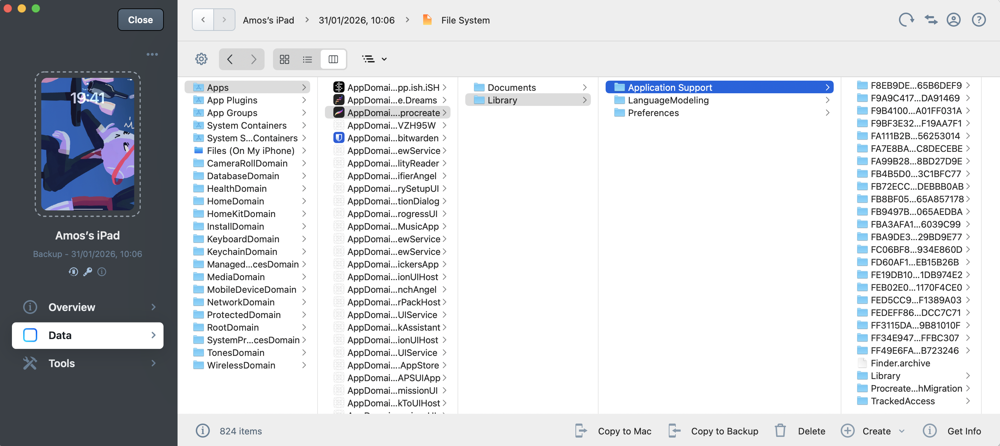

# Backup using Imazing

This proccess will show you step-by-step how to backup your Procreate files using Imazing (you don't need to buy the software). Do mind, you'll need space to store all iPad's files.

---

## Step 01 – Backup Now
Start the backup process by choosing **Backup Now**.


---

## Step 02 – Select Backup
Choose what you want to back up (files, folders, or application data).


---

## Step 03 – Start Backup
Confirm your selection and start the backup process.


---

## Step 04 – Backing Up
The system is actively backing up your data.


---

## Step 05 – Verify Backup
Verify that the backup completed successfully and data integrity is intact.


---

## Step 06 – Backup Complete
Backup finished successfully.


---

## Step 07 – Choose Location
Select where the backup is stored or where it should be restored from.


---

## Step 08 – Select File System
Choose the target file system.


---

## Step 09 – Application Export (Procreate)
Export application-specific data (example shown: Procreate).



---

## Step 10 – Copy to Mac
Copy the backup files to your Mac.


---

## Step 11 – Copying Files
Files are being transferred.


---

## Step 12 – Extraction Complete
All files have been successfully extracted.


---

## Step 13 – Using Python Script


Run a Python script to organize the extracted files.

A. Copy the python script into the same Procreate folder.
B. Open Terminal: cd your_procreate_folder (drag your folder) -> Enter
C. In terminal:

```bash
python3 export_procreate.py /path/to/Application\ Support/
```

---

## Step 14 – Python Script Done
Python script finished running successfully.


---

## Step 15 – Select All
Select all relevant files or folders -> CTRL+CMD+N to create a folder that will put inside the files.


---

## Step 16 – Single Folder Output
All data is now organized into a single folder 🎉.
Highly suggest to [Download Prospect](https://jaromvogel.com/prospect/Prospect_v1_2_1.zip) that way you could preview your Procreate files.


---

## Backup Folder Structure
Final backup folder structure for reference.


