# Backup using Imazing

This proccess will show you step-by-step how to backup your Procreate files using Imazing (you don't need to buy the software). Do mind, you'll need space to store all iPad's files.

---

## Step 01 – Backup Now
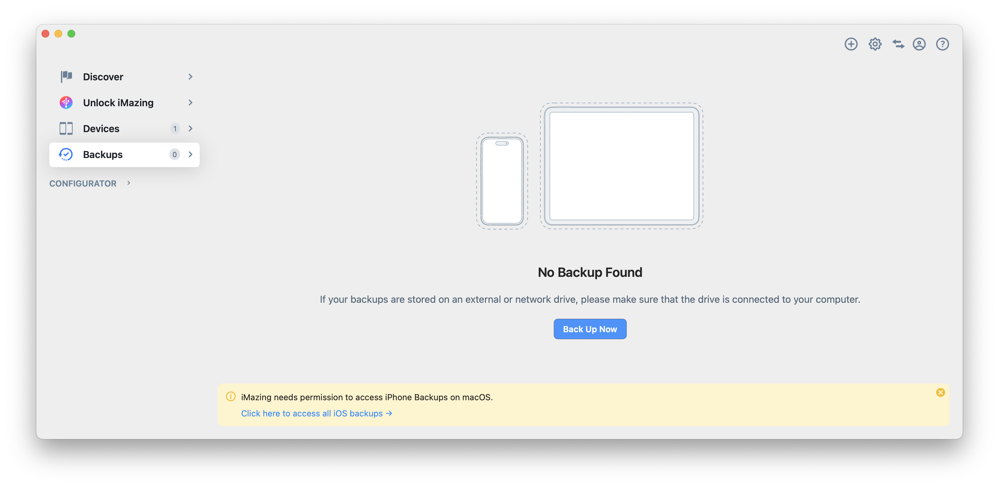

Start the backup process by choosing **Backup Now**.

---

## Step 02 – Select Backup
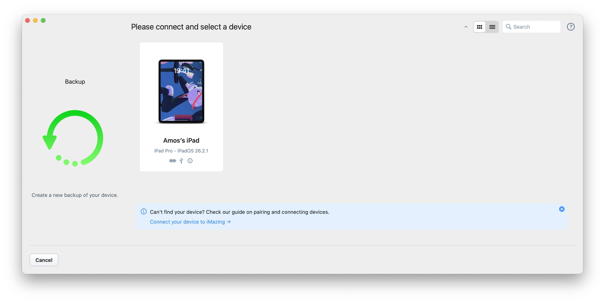

Choose what you want to back up (files, folders, or application data).

---

## Step 03 – Start Backup
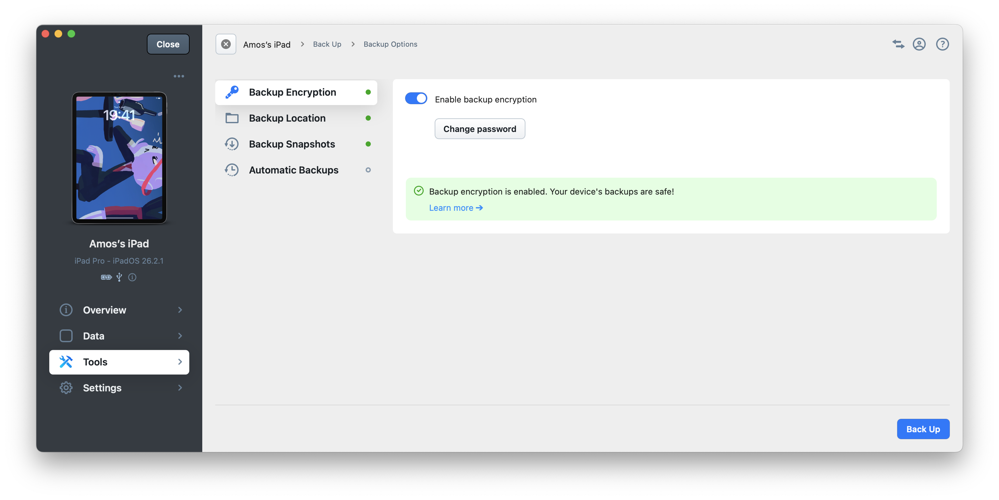

Confirm your selection and start the backup process.

---

## Step 04 – Backing Up
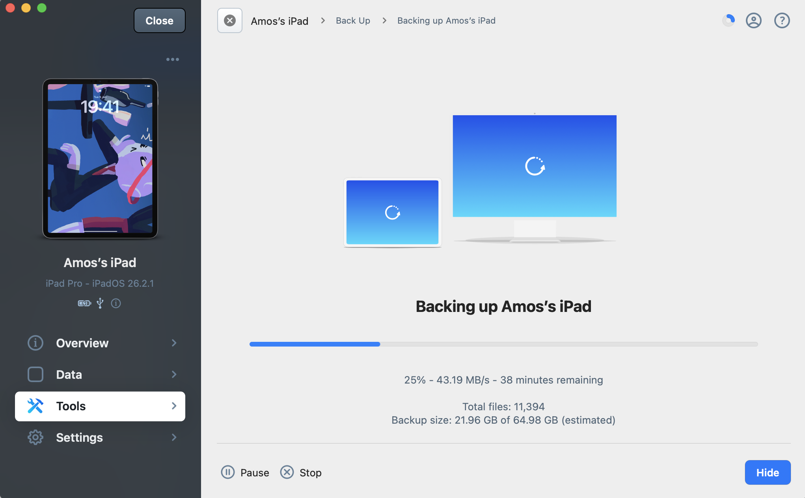

The system is actively backing up your data.

---

## Step 05 – Verify Backup
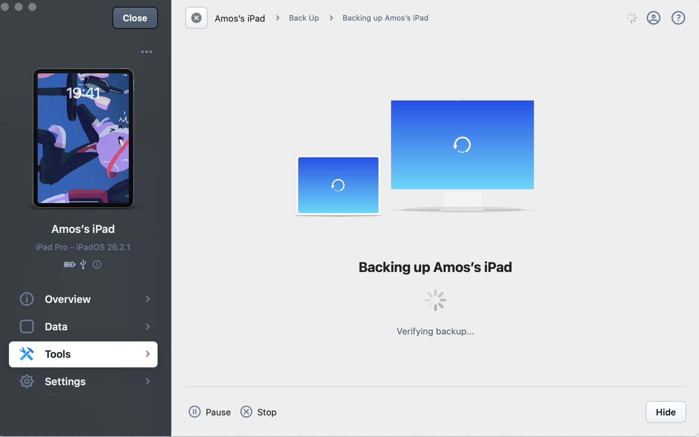

Verify that the backup completed successfully and data integrity is intact.

---

## Step 06 – Backup Complete
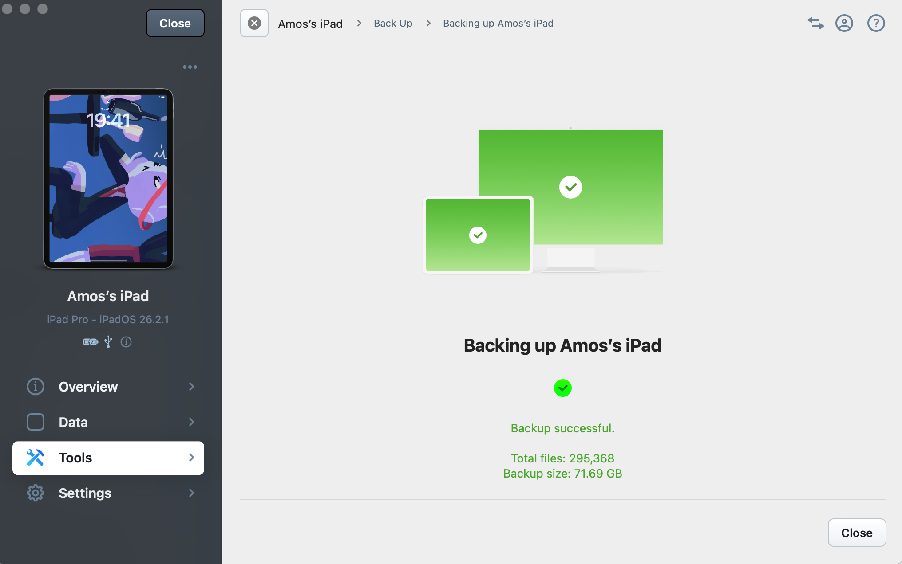

Backup finished successfully.

---

## Step 07 – Choose Location
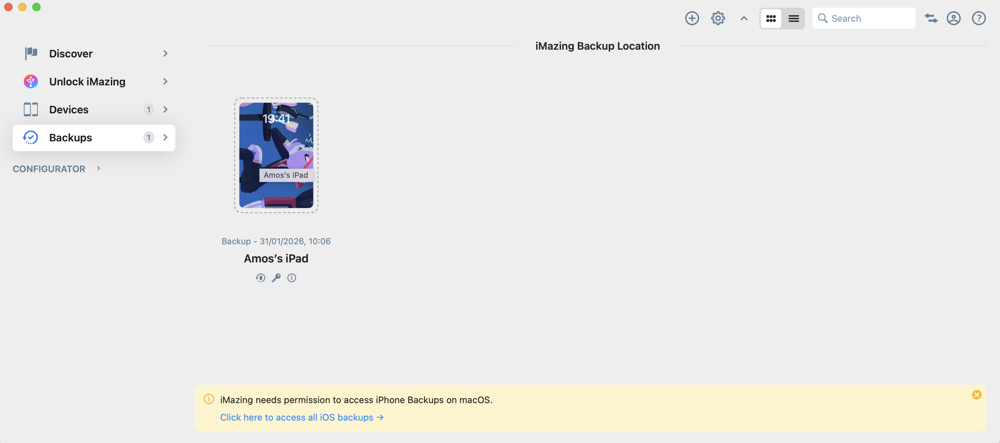

Select where the backup is stored or where it should be restored from.

---

## Step 08 – Select File System
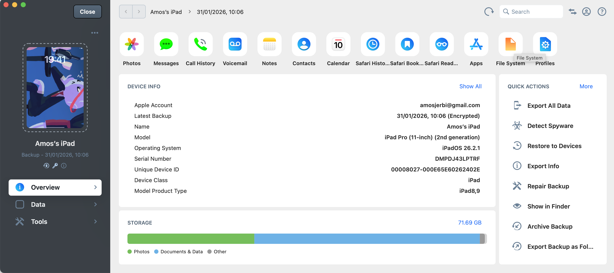

Choose the target file system.

---

## Step 09 – Application Export (Procreate)

Export application-specific data (example shown: Procreate).

---

## Step 10 – Copy to Mac
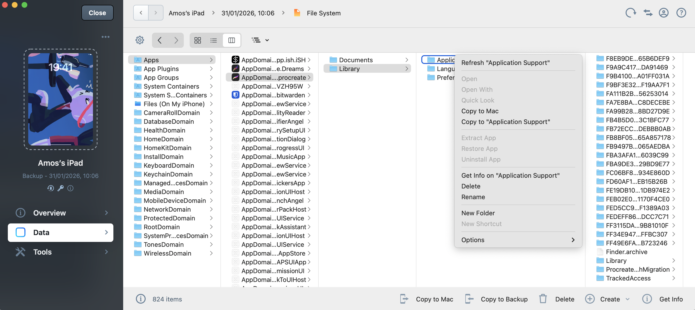

Copy the backup files to your Mac.

---

## Step 11 – Copying Files
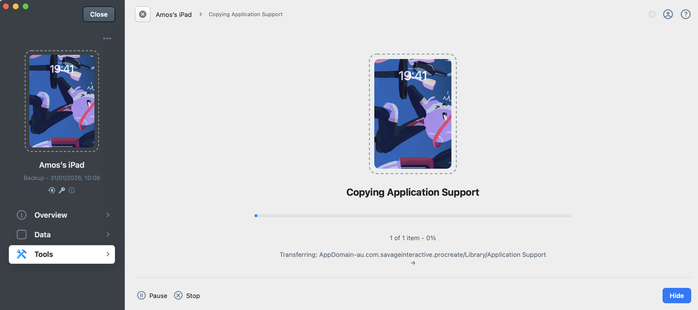

Files are being transferred.

---

## Step 12 – Extraction Complete
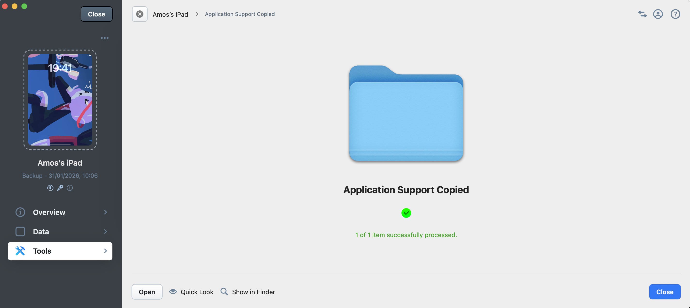

All files have been successfully extracted.

---

## Step 13 – Using Python Script
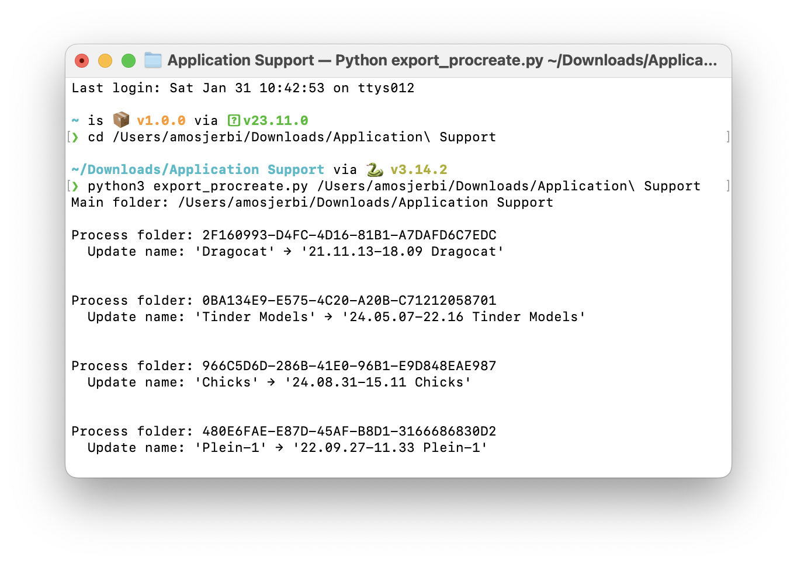

Run a Python script to process or organize the extracted files.

---

## Step 14 – Python Script Done
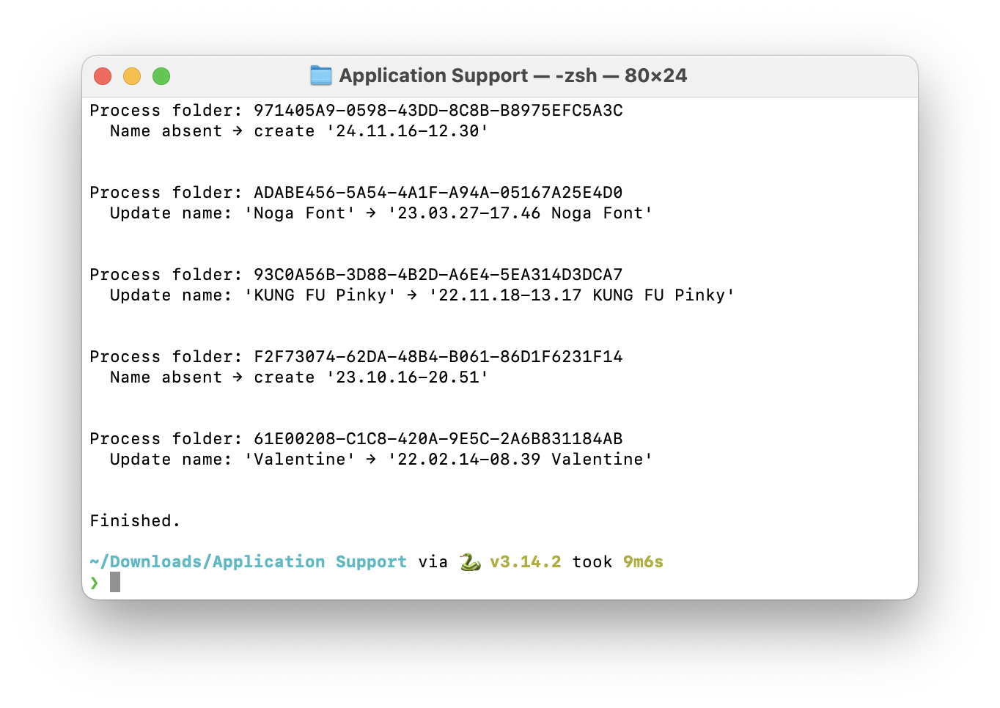

Python script finished running successfully.

---

## Step 15 – Select All
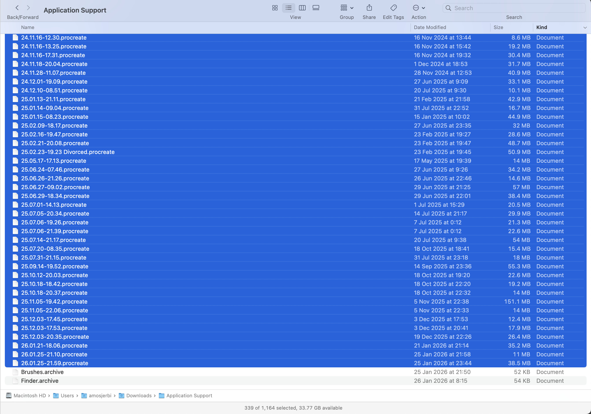

Select all relevant files or folders.

---

## Step 16 – Single Folder Output
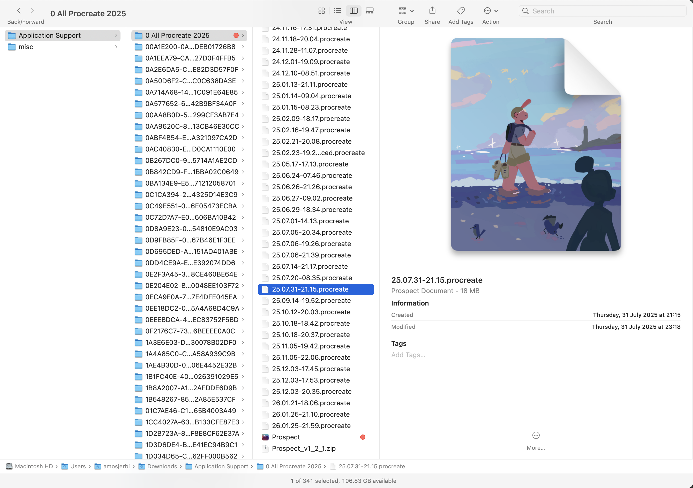

All data is now organized into a single folder.

---

## Backup Folder Structure

Final backup folder structure for reference.

---

## Notes
- Screenshots are ordered numerically to match the flow.
- This README is meant to be viewed directly on GitHub.
- Feel free to reuse this structure for other step-by-step tutorials.
